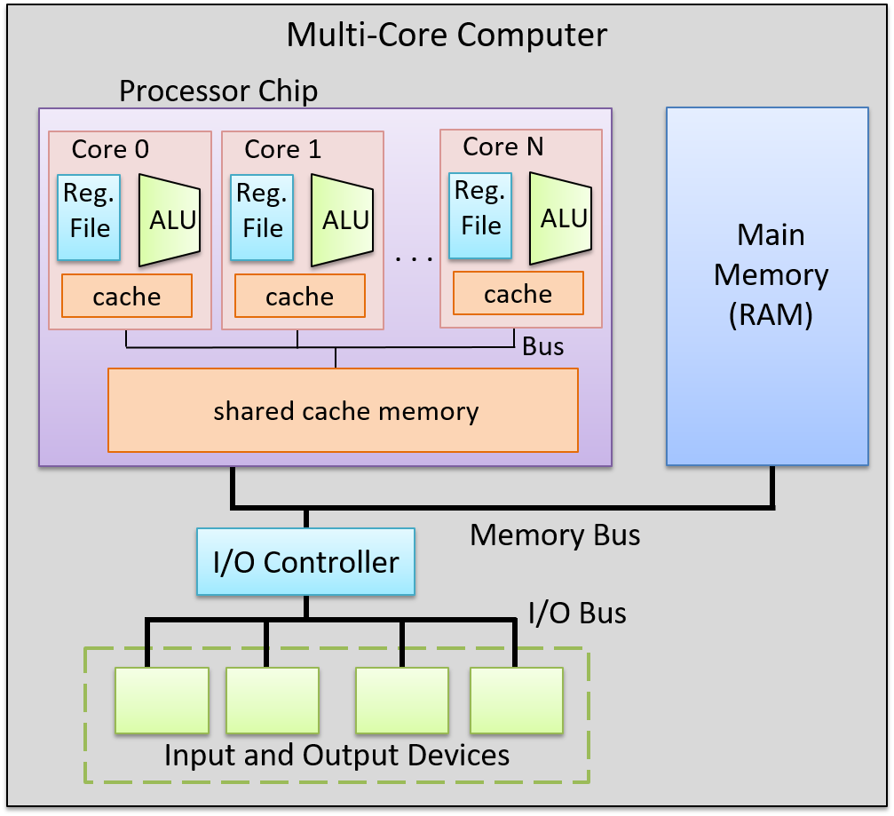

# Multiprocessor Systems

Computer architects maintained performance growth consistent with Moore's Law through the early 2000s by developing single processors with progressively more sophisticated instruction-level parallelism methods and higher clock frequencies. However, further increases in CPU clock speeds beyond this point would have resulted in prohibitively high power consumption. This constraint ushered in the modern age of multicore and multithreaded processor designs, which depend on programmers explicitly writing parallel code to accelerate individual program execution. A **multiprocessor system** consists of multiple processors working together. The primary goal of multiprocessor architecture is to enhance overall system execution speed. These systems are categorized based on two key factors: the mechanism processors use to access memory, and whether the system uses identical processors or a mix of different processor types.

## Introduction

### Shared Memory Multiprocessor Systems

**Shared memory multiprocessor systems** are parallel computing architectures where multiple processors share access to a common physical memory space. In these systems, all processors can directly read from and write to the same memory locations, enabling communication and data sharing through shared variables rather than explicit message passing. Despite the fact that each processor has its own separate, private cache, these systems need to introduce cache coherency mechanisms to ensure all processors see a consistent view of memory (i.e., they all eventually see the same, correct values). There are also two kinds of shared memory multiprocessor systems: **UMA (Uniform Memory Access) Systems** and **NUMA (Non-Uniform Memory Access) Systems**.

#### Uniform Memory-Access (UMA) System

In a UMA system, all processors have equal access time to all memory. UMA systems are typically implemented as **Symmetric Multiprocessing (SMP)**, which refers to an architecture with multiple identical processors running under a single operating system with shared access to centralized main memory. Each processor can execute different programs and operate on different data while sharing common resources, such as memory, I/O devices, and the interrupt system, through an interconnecting system bus. Each processor also maintains its own local cache memory that serves as a fast intermediary between the processor and main memory.

#### Non-Uniform Memory-Access (NUMA) System

SMP systems with bus snooping scale effectively up to around 8-16 processors, but beyond this point they encounter fundamental limitations. Excessive bus traffic from constant snooping and invalidation messages saturates the shared bus as processor count increases. Physical constraints compound the problem: at high clock speeds, wire length limitations and signal propagation delays (approaching the speed of light) become significant bottlenecks. Additionally, a single shared memory controller cannot provide sufficient bandwidth for many processors simultaneously accessing memory.

**NUMA architectures** address these scalability limitations by fundamentally changing the memory organization. Instead of a single shared memory accessible uniformly by all processors, NUMA systems physically distribute memory across multiple nodes, with each node containing one or more processors and its own local memory. Processors can still access any memory location in the system (maintaining a shared address space), but access times are now non-uniform: accessing local memory attached to the same node is fast, while accessing remote memory on another node requires traversing inter-node interconnects and is significantly slower. This distributed organization eliminates the single shared bus bottleneck and allows NUMA systems to scale to hundreds or thousands of processors.

NUMA systems maintain cache coherency through directory-based protocols rather than bus snooping. Each NUMA node contains directory hardware, typically integrated with or located near the memory controller, that tracks the state of memory blocks physically residing in that node. The directory maintains metadata for each cache line by storing a valid bit (indicating which processors currently have this cache line cached) for every processor and a dirty bit (indicating whether any processor has modified the data). These distributed directories communicate with each other over the interconnect network to coordinate cache coherency across all nodes in the system.

When a processor requests data, the request is routed to the home directory of the node where that memory physically resides. The directory checks its metadata: if the data is clean (i.e., the dirty bit not set), it provides the data directly and sets the valid bit for the requesting processor. If the data is dirty, the directory retrieves the updated value from the processor currently holding it, writes it back to main memory, and then provides it to the requester. When a processor writes to a cache line, the directory sends invalidate messages only to processors with valid bits set, those that actually have the line cached. This targeted invalidation contrasts with SMP systems, where processors broadcast invalidate messages to all processors on the shared bus, requiring every processor to check if the message is relevant to its own cache. The directory-based approach eliminates broadcast traffic, enabling NUMA systems to scale to hundreds or thousands of processors. For very large systems, hierarchical directory schemes employ multiple directory levels communicating over general-purpose interconnect networks rather than shared CPU buses.

For systems programmers, NUMA awareness matters primarily for performance optimization. Remote memory accesses can be 2-3x slower than local accesses. Tools like `numactl` allow binding processes and memory allocations to specific nodes, maximizing fast local memory accesses while minimizing expensive cross-node traffic.

### Distributed Memory Multiprocessor Systems

In **distributed memory multiprocessor systems**, each node has its own private memory and there is no shared address space. Processors cannot directly read or write each other's memory; all communication requires explicit message passing over a network (e.g., MPI).

This architecture scales to thousands or millions of nodes (clusters, supercomputers) and is well-suited for embarrassingly parallel workloads with high computation-to-communication ratios. The tradeoff is that network latency sits orders of magnitude below RAM in the memory hierarchy, making it a poor fit for tightly coupled algorithms that require frequent data exchange between nodes.

## Cache Coherence

The critical challenge in SMP systems is maintaining **cache coherency**: ensuring all processors see a consistent view of memory despite each having its own private cache. When one processor modifies data, other processors may have stale copies in their caches, creating inconsistency. SMP systems solve this through **bus snooping**, where each processor monitors a shared bus for cache events from other processors and updates its cache accordingly.

Cache coherency is managed through hardware protocols, with **MESI** being the most common (other protocols include **MOESI** and **MESIF**). MESI stands for the four states a cache line can be in: **Modified**, **Exclusive**, **Shared**, or **Invalid**.

The protocol assigns one of four states to every cache line (mostly in L1 cache), answering two questions at all times: *is main memory up to date?* and *does any other cache hold a copy?*

- **Modified (M)**: This cache has the only copy, and it has been written to. Main memory is stale. This cache is solely responsible for writing the data back before anyone else can use it.
- **Exclusive (E)**: This cache has the only copy, and it matches main memory. Since no other cache holds the line, a write can proceed without any bus communication.
- **Shared (S)**: This cache holds a copy, and other caches may too. All copies match main memory. The line is effectively read-only, since a write requires coordinating with other caches first.
- **Invalid (I)**: The cache line holds no usable data. Any access is a miss.

For any two caches, the permitted combinations of states for the same cache line are:

| | M | E | S | I |
| --- | --- | --- | --- | --- |
| **M** | No | No | No | Yes |
| **E** | No | No | No | Yes |
| **S** | No | No | Yes | Yes |
| **I** | Yes | Yes | Yes | Yes |

Modified and Exclusive are mutually exclusive with every state except Invalid, since both mean "I am the only cache holding this line." Shared can only coexist with Shared or Invalid, since it means multiple caches hold a clean read-only copy and that is safe.

### MESI State Transitions

In the scenarios below, Core A is the cache whose state is transitioning. Core B is any other core on the bus whose request Core A observes via snooping.

#### Read miss, no other holder (Invalid → Exclusive)

Core A misses on a read and broadcasts a request on the bus. No other cache responds. Core A fetches the block from main memory and marks it Exclusive, as it is the sole holder and main memory is authoritative.

#### Read miss, another cache holds it (Invalid → Shared)

Core A misses and broadcasts a read request. Core B holds the line and transitions as a consequence:
- If B is in Shared, B stays Shared and Core A loads the line as Shared.
- If B is in Exclusive, B transitions to Shared and Core A loads the line as Shared.
- If B is in Modified, B intercepts the request, writes the dirty data back to main memory first, then both B and Core A transition to Shared.

Once two caches hold the same cache line, both are Shared.

#### Write miss (Invalid → Modified)

Core A has the line as Invalid and wants to write. Core A broadcasts a read-with-intent-to-modify request and fetches the block. Any other cache holding the line must give up its copy as a consequence: if Modified, it writes the dirty data back to main memory first, then goes Invalid; if Exclusive or Shared, it goes Invalid immediately. Core A transitions to Modified and writes.

#### Read hit (Exclusive → Exclusive)

Core A holds the line as Exclusive and reads from it. The data is served directly from the local cache. No bus traffic.

#### Write hit (Exclusive → Modified)

Core A holds the line as Exclusive and wants to write. Since no other cache has a copy, Core A simply writes and transitions to Modified with no bus traffic. This is the fast path.

#### Read hit (Shared → Shared)

Core A holds the line as Shared and reads from it. The data is served directly from the local cache. No bus traffic.

#### Write hit (Shared → Modified)

Core A holds the line as Shared and wants to write. Since Core A already has a valid copy, it broadcasts an invalidate request on the bus. Every other cache holding the line transitions to Invalid as a consequence. Core A transitions to Modified and performs the write. Main memory is now stale.

#### Read or write hit (Modified → Modified)

Core A holds the line as Modified and reads or writes to it again. It is already the sole owner with the authoritative copy, so it serves the access locally and stays Modified. No bus traffic.

#### Eviction (Modified → Invalid)

Core A needs to load a new block into a slot occupied by a Modified line. Before evicting, Core A writes the dirty data back to main memory, then transitions to Invalid and frees the slot.

### Performance Problems

However, cache coherency mechanisms introduce two notable performance problems.

**False sharing** occurs when different variables that happen to reside on the same cache line are modified by different processors. Since cache coherency operates at cache line granularity, modifications to logically independent variables trigger unnecessary invalidations across processors.

For example, if Thread A frequently updates `counter_a` and Thread B frequently updates `counter_b`, but both counters are adjacent in memory and share the same cache line, each write causes the cache line to bounce between processors even though the threads aren't actually sharing data. This ping-pong effect can cause severe performance degradation in multithreaded code.

**Write contention** occurs when multiple processors genuinely write to the same or nearby shared data, triggering constant invalidation messages as cache coherency protocols maintain consistency. Each write to shared data requires broadcasting invalidations to all other caches holding that line, marking their copies Invalid while the writing processor marks its copy Modified. When multiple processors compete to write, the cache line repeatedly bounces between processors' caches, creating significant overhead from the constant coherency traffic. Unlike false sharing (where the contention is artificial), write contention reflects a fundamental limitation: cache coherency protocols become increasingly expensive as the number of processors writing to shared data increases. Minimizing write contention requires algorithmic approaches such as using per-thread local data that's only merged periodically, employing lock-free data structures that reduce synchronization points, or redesigning algorithms to reduce the frequency of shared writes.

## Memory Consistency

Cache coherency protocols (MESI or MOESI) guarantees that all cores will *eventually* see the correct value for a memory location. But it says nothing about *when* that value becomes visible. This is the problem of **memory consistency**: defining the rules for the order in which memory operations performed by one core become visible to others.

> [!NOTE]
> Coherence and consistency are often conflated but address different questions. Cache coherence defines the required behavior of reads and writes to the *same* memory address. Its goal is to make a parallel memory system behave as if the caches were not there, just like a uniprocessor's cache is invisible to the programmer. Memory consistency defines the behavior of reads and writes to *different* addresses. Specifically, when a write to X becomes visible relative to reads and writes to other addresses.

### The Hardware Gaps

Two hardware structures create windows where cores see inconsistent state even with cache coherency protocols in place.

#### Write buffer (store buffer)

When a core writes a value, the write does not go directly to L1 cache. It first lands in a **write buffer**, a small queue between the core and its L1, so the core can keep executing without stalling on every write. While a write sits in the buffer, MESI has not been triggered yet (i.e, no invalidate has been sent). Other cores reading that address load the old value from their own caches and have no idea anything changed.

> [!NOTE]
> Write buffering preserves single-threaded behaviour via **store-to-load forwarding**: before going to memory, a read first checks the store buffer for a pending write to the same address, and uses that value if found. For instance, in `x = 1; println(x)`, the write `x = 1` sits in the store buffer before reaching main memory, but `println(x)` forwards directly from the buffer and correctly prints `1`.

To see how this breaks down with multiple threads, consider two threads running concurrently, where `x` and `y` both start at `0` in memory:

- Thread 1: (1) `x = 1`, then (2) `print(y)`
- Thread 2: (3) `y = 1`, then (4) `print(x)`

First, (1) and (3) execute, placing `x = 1` and `y = 1` into their respective cores' store buffers, where neither write has reached main memory yet. Next, (2) executes on Core 1, reading `y`. Core 1 checks its store buffer and finds no entry for `y`, so it reads from memory and gets `0`. Then (4) executes on Core 2, reading `x`. Core 2's store buffer has no entry for `x` either, so it too reads from memory and gets `0`. At some indeterminate point later, the cache hierarchy drains both store buffers and propagates the writes to memory.

Under x86-TSO and relaxed memory models, this program can therefore print `00`, as both threads observe the other's write as if it hadn't happened yet. This is an outcome that SC explicitly rules out, since SC requires that a completed write be immediately visible to all cores. Store buffers introduce exactly this kind of surprise: writes that are "done" from the issuing core's perspective are invisible to everyone else until the buffer drains.

#### Invalidation queue

When a write finally commits from the write buffer to L1, MESI sends an invalidate message to every other cache holding that line. But the receiving core does not have to acknowledge that invalidation immediately. It goes into an **invalidation queue** so the core does not stall waiting for it. If a read happens before those invalidations are processed, the core hits its own now-stale cache line and returns the old value, even though an invalidation was already pending.

So there are two windows where a core can observe stale data:
1. While the write is still in the writer's store buffer (before reaching L1, before any invalidate is sent)
2. While the invalidation is sitting in the reader's invalidation queue (sent, but not yet acknowledged)

### Hardware Memory Models

A **memory consistency model** defines what guarantees a CPU architecture makes about when writes become visible to other cores. Different architectures make different tradeoffs between performance and strictness.

There are four possible ordering constraints between memory operations, where X and Y are not necessarily the same address:

- **W→R**: a write to X must commit before a subsequent read from Y
- **W→W**: a write to X must commit before a subsequent write to Y
- **R→R**: a read from X must commit before a subsequent read from Y
- **R→W**: a read from X must commit before a subsequent write to Y

A memory model is defined by which of these it enforces. Relaxing a constraint means the hardware is free to reorder those operations for performance.

#### Sequential Consistency (SC)

Defined by Lamport (1976), sequential consistency is the ideal model that enforces all four orderings. It makes two guarantees: all memory operations across all cores appear to execute in some single global sequential order, and each individual core's operations appear in that global order in the same order they appear in the program (program order). The result is that the system behaves as if all cores are sharing a single memory with no caches or buffers, like a switch that picks one core at a time, completes its memory operation atomically, then picks another.

In practice, no modern high-performance CPU implements sequential consistency fully, as it would require flushing the store buffer and draining the invalidation queue on every operation, eliminating exactly the optimizations that make out-of-order and pipelined execution fast.

> [!NOTE]
> The switch can pick any core at any time, so instructions from different cores freely interleave in the global order. What it cannot do is violate a single core's program order. P0's stores and loads must appear in the global sequence in the same order they appear in P0's program, and likewise for every other core.

##### x86 Total Store Order (x86-TSO)

Total Store Order enforces W→W, R→R, and R→W, but **relaxes** W→R. This means a write sitting in the store buffer can be bypassed by a subsequent read to a different address, so the core reads from its cache while the write has not committed yet. Once a write does reach L1, invalidations are broadcast to all other cores and processed promptly, so while a write may be delayed in the store buffer, once it lands, all cores observe it at the same time. There is a single coherent global order of writes that every core agrees on. TSO is strict enough that most concurrent code works correctly on x86 without explicit memory fences.

#### ARM Relaxed Memory Model

Can relax all four orderings, making it the weakest common model. Cores can observe writes from other cores in a different order than they occurred, and even two cores can disagree on the order in which writes became visible. Correct concurrent code on ARM requires explicit memory fences at every synchronization point.

### Memory Fences

A **memory fence** (a.k.a memory barrier) is an instruction that forces the CPU to flush one or both buffers before continuing:

- **Store fence**: drain the write buffer so all pending writes reach L1 (and invalidates are sent) before any subsequent stores.
- **Load fence**: drain the invalidation queue so all pending invalidations are acknowledged before any subsequent loads.
- **Full fence**: both.

| | Store fence | Load fence | Full fence |
| --- | --- | --- | --- |
| x86-64 | `sfence` | `lfence` | `mfence` |
| ARM | `dmb st` | `dmb ld` | `dmb` |

However, memory fences are notoriously expensive, costing hundreds of CPU cycles, and are fairly tricky to use.

This is why concurrent programming requires atomics, mutexes, and memory ordering annotations even on hardware with full MESI coherency. MESI guarantees the right value will eventually be visible, but without explicit fences, there is no guarantee about *when*.

