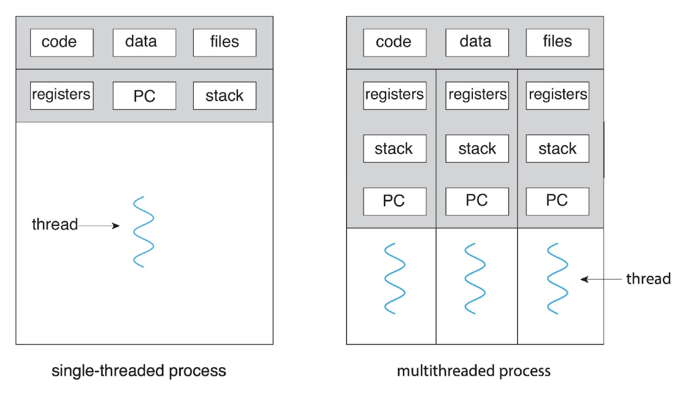

# Processes and Threads

## Concurrency vs Parallelism

```
Concurrency (single core):           Parallelism (multi-core):

Task A: ██░░██░░██                   Task A: ██████████
Task B: ░░██░░██░░                   Task B: ██████████
─────────────────→ time              ─────────────────→ time
```

# Processes and Threads

## Processes

...

## Threads

### Introduction

A **thread** is



### Threads vs Processes

Threads and processes share similarities:
- Both have their own logical control flow.
- Both can run concurrently
- Both are context switched

And differ in two areas:
- Threads run in a shared memory space (notably share code and data), while processes typically run in separate memory spaces.
- Creating processes is more expensive than creating threads.

### Creating & Joining Threads

To create threads, we use the `std::thread::spawn` method, which accepts a closure that will be run by a thread.

Each thread has an associated thread ID, where the ID of the currently executing thread can be accessed via `std::thread::current().id()`.

However, it's important to note that `std::thread::spawn` requires the closure to be `'static`, which means it can't hold references to local variables that might be dropped when the spawning function ends. This means that every variable captured by the thread's closure typically must be moved into it, which transfers ownership, using the `move` keyword.

Rust's threads API enforces this strict behaviour because a thread often runs until the very end of the program's execution, which may lead to a thread holding, then using onto a reference to a variable no longer in scope, which we call a **use-after-free** bug.

Additionally, since the closure must also be `Send`, the captured variables must also be `Send`.

To ensure that threads complete before the spawning function returns, you should call `.join()` on their `JoinHandle`s (what gets returned from `std::thread::spawn`).

This pattern of splitting work into parallel tasks and joining their results is also known as **fork/join parallelism**.

```rust
use std::thread;

fn main() {
    let t1 = thread::spawn(worker); // equivalent to thread::spawn(|| worker());
    let t2 = thread::spawn(worker);

    println!("Main thread");

    t1.join().unwrap();
    t2.join().unwrap();
}

fn worker() {
    let id = thread::current().id();
    println!("Thread {id:?}");
}
```

```rust
use std::thread;

fn main() {
    let nums = vec![1, 2, 3];

    thread::spawn(move || {
        for n in &nums {
            println!("{n}");
        }
    })
    .join()
    .unwrap();
}
```

Alternatively, we can create scoped threads which are threads will not outlive a certain scope, where the thread's closure may capture non-`'static` data. Scoped threads can be created using the `std::thread::scope` function.

Consider the following example:

```rust
use std::thread;

fn main() {
    let nums = vec![1, 2, 3];

    thread::scope(|s| {
        s.spawn(|| {
            println!("count: {}", nums.len());
        });
        s.spawn(|| {
            for n in &nums {
                println!("{n}");
            }
        });
    });
}
```

We call the `std::thread::scope` function and create a closure, which gets directly executed and gets an argument, `s`, representing the scope. We then use `s` to spawn two threads, where their closures can borrow local variables like `numbers`, since the scope thread `spawn` method doesn't have a `'static` bound on its argument type. At the end of the scope, all threads that haven’t been joined yet, are automatically joined.

### Returning Values from a Thread

Getting a value back out of the thread is done by returning it from the closure. This return value can be obtained from the `Result` returned by the `join` method:

```rust
fn main() {
    let numbers = Vec::from_iter(0..=1000);

    let t = thread::spawn(move || {
        let count = numbers.len();
        let sum = numbers.iter().sum::<usize>();
        sum / count
    });

    let average = t.join().unwrap();
    println!("average: {average}");
}
```