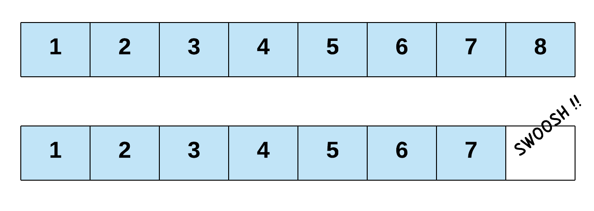
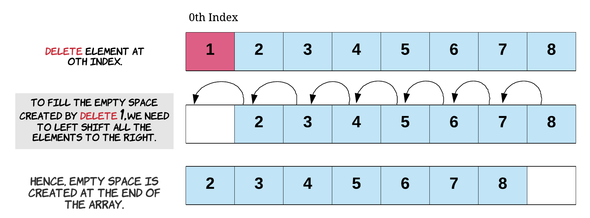
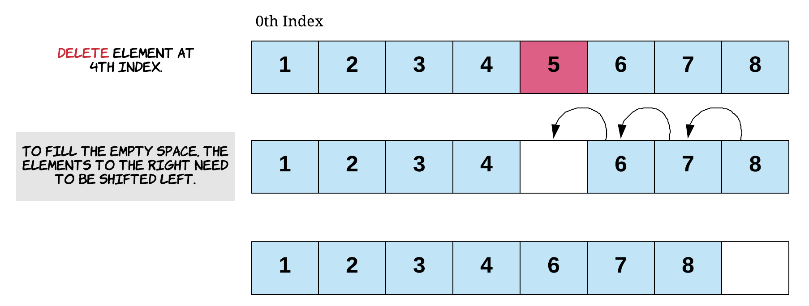

# List

## Abstract Data Type

| Operation | Description |
| --- | --- |
| `get_first()` | Returns the first element in the list. |
| `get_last()` | Returns the last element in the list. |
| `get(index)` | Returns the element at the specified index. |
| `add_first(element)` | Inserts the element at the beginning of the list. |
| `add_last(element)` | Appends the element to the end of the list. |
| `add(index, element)` | Inserts the element at the specified index, shifting subsequent elements. |
| `set(index, element)` | Replaces the element at the specified index with the given element. |
| `remove_first()` | Removes and returns the first element in the list. |
| `remove_last()` | Removes and returns the last element in the list. |
| `remove(index)` | Removes and returns the element at the specified index, shifting subsequent elements. |

## C++ STL API

```cpp
#include <vector>

// Creates an empty list
std::vector<T> v;

// Returns the first element in the list
v.front();

// Returns the last element in the list
v.back();

// Returns the element at the specified index
v[<index>];

// Inserts the element at the beginning of the list
v.insert(v.begin(), <element>);

// Appends the element to the end of the list
v.push_back(<element>);

// Inserts the element at the specified index, shifting subsequent elements
v.insert(v.begin() + <index>, <element>);

// Replaces the element at the specified index with the given element
v[<index>] = <element>;

// Removes the first element in the list
v.erase(v.begin());

// Removes the last element in the list
v.pop_back();

// Removes the element at the specified index, shifting subsequent elements
v.erase(v.begin() + <index>);
```

## Use Case

You need an ordered sequence of elements where each element has an index.

## Dynamic Array

### Lookup

Index into the `array` at the desired index \\(i\\) if it is within bounds \\([0, N)\\).

```
func get(this, i: UInt) -> Result[E, ListError] {
    if i >= this.count {
        return Error(ListError::IndexOutOfBounds);
    } 
    Ok(this.data[i])
}
```

### Insertion

1. Reject the insertion if the desired index \\(i\\) is less than \\(0\\).
2. Resize the current array if the number of elements in the current array is equal to the capacity \\(N\\) of the array by allocating a new array of capacity \\(N * 1.5\\) (i.e., **geometric resizing**), then copying all elements from the current array to the new array.
3. If inserting at index \\(N - 1\\), skip to step 4. Otherwise, shift all elements from \\([i + 1, N)\\) to the right to make way for the new element.
4. Write the new element at index \\(i\\).

```
func add(this, i: UInt, e: E) -> Result[(), ListError] {
    if i > this.count {
        return Error(ListError::IndexOutOfBounds);
    }
    if this.count == this.data.capacity() {
        let new_capacity = if this.count == 0 { 1 } else { (this.count.to_float() * 1.5).ceil() as UInt };
        try this.resize(new_capacity);
    }
    for j in (i..this.count).rev() {
        this.data[j + 1] = this.data[j];
    }
    this.data[i] = e; 
    this.count += 1;
    Ok(())
}

func resize(this, new_capacity: UInt) -> Result[(), ListError] {
    let new_array = Array::with_capacity(new_capacity);
    for i in 0..this.count {
        new_array[i] = this.data[i];
    }
    this.data = new_array;
    Ok(())
}
```


### Deletion

1. Starting at index \\(i\\), up till and including \\(N - 2\\), replace its element with the element to its left.
2. (Optional) Zero out the last element at index \\(N - 1\\).

```
func remove(this, i: UInt) -> Result[E, ListError] {
    if i >= this.count { 
        return Error(ListError::IndexOutOfBounds); // also prevents `this.count - 1` underflow when `this.count` is 0
    }
    let old_element = this.data[i];
    for j in i..this.count - 1 { 
        this.data[j] = this.data[j + 1];
    }
    this.data[this.count - 1] = 0; 
    this.count -= 1;
    Ok(old_element)
}
```







### Complexity Analysis

| Operation | Time Complexity |
| --- | --- |
| Add at the last position | worst-case \\(O(n)\\), but amortized \\(O(1)\\)  |
| Add at the first position | worst-case \\(O(n)\\) |
| Add in the middle position | worst-case \\(O(n)\\) |
| Lookup by index | worst-case \\(O(1)\\) |
| Remove at the last position | worst-case \\(O(1)\\) |
| Remove at the first position | worst-case \\(O(n)\\) |
| Remove in the middle position | worst-case \\(O(n)\\) |

## Singly Linked List

### Lookup

TO DO

### Insertion

TO DO

### Deletion

TO DO

### Complexity Analysis

| Operation | Time Complexity |
| --- | --- |
| Add at the head | worst-case \\(O(1)\\) |
| Add at the tail | worst-case \\(O(n)\\), or \\(O(1)\\) with a maintained tail pointer |
| Add in the middle | worst-case \\(O(n)\\) |
| Lookup by index | worst-case \\(O(n)\\) |
| Remove at the head | worst-case \\(O(1)\\) |
| Remove at the tail | worst-case \\(O(n)\\) |
| Remove in the middle | worst-case \\(O(n)\\) |

## Doubly Linked List

### Lookup

TO DO

### Insertion

TO DO

### Deletion

TO DO

### Complexity Analysis

| Operation | Time Complexity |
| --- | --- |
| Add at the head | worst-case \\(O(1)\\) |
| Add at the tail | worst-case \\(O(1)\\) (with a maintained tail pointer) |
| Add in the middle | worst-case \\(O(n)\\) to find the position, \\(O(1)\\) to link |
| Lookup | worst-case \\(O(n)\\) |
| Remove at the head | worst-case \\(O(1)\\) |
| Remove at the tail | worst-case \\(O(1)\\) (with a maintained tail pointer) |
| Remove in the middle | worst-case \\(O(n)\\) to find the node, \\(O(1)\\) to unlink |

> [!NOTE]
> In order to reduce edge cases, and when your algorithm might modify the head, create a **sentinel head** as well as a **sentinel tail** for a doubly linked list. These are extra nodes storing no real data which is placed immediately before the head or immediately after the tail. We create this so that insertions and removals at a boundary no longer need to be different than the middle of the linked list logic since modifications at the head or tail typically require a predecessor/successor, yet the head/tail has none.
